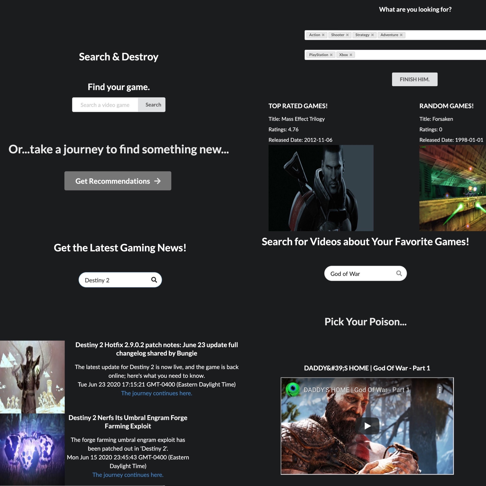

# Search & Destroy

*As a group we created a game search application using html, css, semantuic ui, and powerd by javascript and jQuery. The appliaction allows the user to search a game, get reccomended games based on selected criteria, and retrieve news and video content of the inputed game. A several third-party API's was used to retrieve data for user inputed games.This app will run in the browser and feature a clean, polished, responsive user interface. Ensuring that it adapts to multiple screen sizes.

*On this application, their are three sections in the navbar; home, news, and video. Home section allow users to search a game of their choosing or get a recmmended game base on the selected criteria. News section allow users to retrieve the lastest informaton of any inputed game. Video section allow users to search for a game video contents.

*Application Link: https://microxgleek94.github.io/ColumbiaProject_-1/

*Application Desktop/Mobile Image: 

